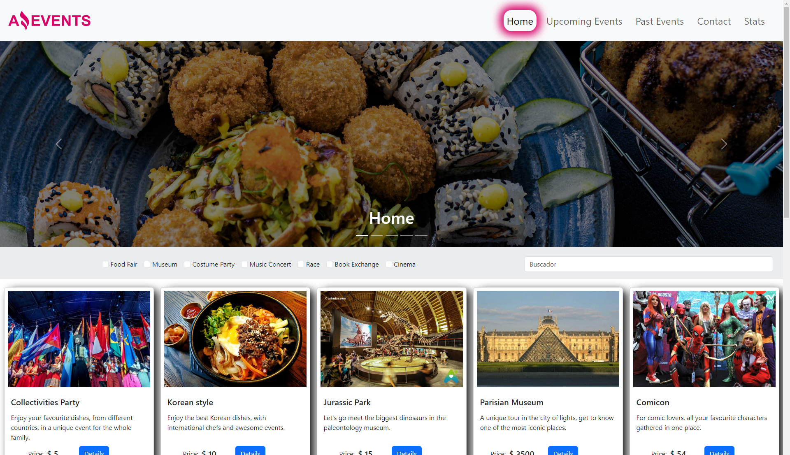
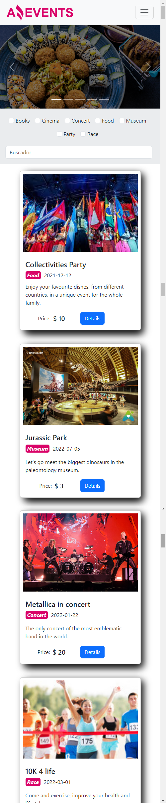

# AmazingEvents - Jesus Vera Pompa

Esta es una solución para [Mind Hub](https://mindhubweb.com/). Los desafíos de Mind Hub te ayudan a mejorar tus habilidades de codificación mediante la creación de proyectos realistas.

## Índice

- [Descripción general](#descripción-general)
- [El desafío](#el-desafío)
- [Captura de pantalla](#captura-de-pantalla)
- [Enlaces](#enlaces)
- [Mi proceso](#mi-proceso)
- [Construido con](#construido-con)
- [Lo que aprendí](#lo-que-aprendí)
- [Desarrollo continuo](#desarrollo-continuo)
- [Recursos útiles](#recursos-útiles)
- [Autor](#autor)
- [Agradecimientos](#agradecimientos)

## Descripción general

### El desafío

Los usuarios deberían poder:

- Sprint 1 - AmazingEvents - Jesus Vera Pompa

- Sprint 2 - Actualizado los JavaScript - AmazingEvents - Jesus Vera Pompa

- Sprint 3 - Actualizado los JavaScript con eventos y filtros - AmazingEvents - Jesus Vera Pompa

- Sprint 4 - Actualizado los JavaScript con API, Funciones y Tabla Dinamica - Jesus Vera Pompa

### Captura de pantalla

### Enlaces

- URL de la solución: [Agregar la URL de la solución aquí](https://github.com/JesusVeraPompa/amazingEventsJesusVera)
- URL del sitio en vivo: [Agregar la URL del sitio en vivo aquí](https://jesusverapompa.github.io/amazingEventsJesusVera/)

## Mi proceso

### Creado con

- Marcado HTML5 semántico
- Propiedades personalizadas CSS
- Flexbox
- Cuadrícula CSS
- Introducción a JavaScript
- Funciones
- Condicionales
- Matrices y objetos
- Bucles
- DOM
- Funciones de alto orden y métodos de matriz
- Eventos
- Parámetros de búsqueda de URL
- Asincronismo (especialmente búsqueda)
- ECMA 6 (especialmente importación y exportación)

### Lo que aprendí

- Introducirse al pensamiento lógico-computacional.
- Aprender los fundamentos comunes a todos los lenguajes de programación ( variables y tipos de datos, condicionales, bucles y funciones ). 
- Continuar utilizando las tecnologías del módulo anterior agregándoles “dinamismo” a través de JavaScript.
- Desarrollar una aplicación frontend completa de forma individual.
- Desarrollar una aplicación frontend completa de forma grupal “autogestionada” y presentarla al “cliente”!
- Manejarse de forma colaborativa en GitHub.

### Desarrollo continuo

### Recursos útiles

- Discord
- Zoom
- Plataforma Mindhub
- GitHub
- HTML, CSS, Bootstrap
- Git
- JavaScript

## Autor

- Sitio web - [Agrega tu nombre aquí](https://techpompahelp.com/)
- Frontend Mentor - [@yourusername](https://www.frontendmentor.io/profile/JesusVeraPompa)
- Linkedin - [@yourusername](https://www.linkedin.com/in/jes%C3%BAs-alberto-vera-pompa-26ba43190/)

## Agradecimientos

